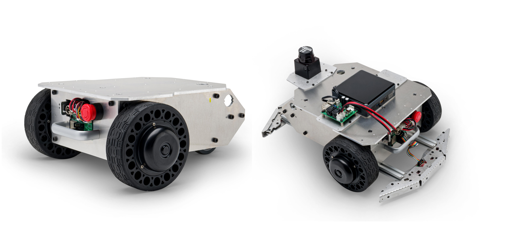

# メガローバーVer.3.0 ROS2パッケージ

<p align="center">
  
</p>

ヴイストン株式会社より発売されている全方向移動台車「[メガローバーVer.3.0](https://www.vstone.co.jp/products/wheelrobot/ver.3.0_normal.html)」をROS 2で制御するためのパッケージです。別途Linux搭載のPC及びロボット実機が必要になります。

# 目次
<!-- TOC -->

- [概要](#%E6%A6%82%E8%A6%81)
- [必要機器 & 開発環境](#%E5%BF%85%E8%A6%81%E6%A9%9F%E5%99%A8--%E9%96%8B%E7%99%BA%E7%92%B0%E5%A2%83)
- [パッケージ構成](#%E3%83%91%E3%83%83%E3%82%B1%E3%83%BC%E3%82%B8%E6%A7%8B%E6%88%90)
- [インストール方法](#%E3%82%A4%E3%83%B3%E3%82%B9%E3%83%88%E3%83%BC%E3%83%AB%E6%96%B9%E6%B3%95)
- [使用方法](#%E4%BD%BF%E7%94%A8%E6%96%B9%E6%B3%95)
    - [URDFモデルの表示](#urdf%E3%83%A2%E3%83%87%E3%83%AB%E3%81%AE%E8%A1%A8%E7%A4%BA)
    - [メガローバー（実機）との通信](#%E3%83%A1%E3%82%AC%E3%83%AD%E3%83%BC%E3%83%90%E3%83%BC%E5%AE%9F%E6%A9%9F%E3%81%A8%E3%81%AE%E9%80%9A%E4%BF%A1)
        - [有線シリアル接続の場合](#%E6%9C%89%E7%B7%9A%E3%82%B7%E3%83%AA%E3%82%A2%E3%83%AB%E6%8E%A5%E7%B6%9A%E3%81%AE%E5%A0%B4%E5%90%88)
        - [Wi-Fi 接続の場合](#wi-fi-%E6%8E%A5%E7%B6%9A%E3%81%AE%E5%A0%B4%E5%90%88)
    - [odometryをpublish](#odometry%E3%82%92publish)
    - [台車ロボットをROS 2経由で遠隔操作](#%E5%8F%B0%E8%BB%8A%E3%83%AD%E3%83%9C%E3%83%83%E3%83%88%E3%82%92ros-2%E7%B5%8C%E7%94%B1%E3%81%A7%E9%81%A0%E9%9A%94%E6%93%8D%E4%BD%9C)
        - [キーボードで操作](#%E3%82%AD%E3%83%BC%E3%83%9C%E3%83%BC%E3%83%89%E3%81%A7%E6%93%8D%E4%BD%9C)
        - [マウスで操作](#%E3%83%9E%E3%82%A6%E3%82%B9%E3%81%A7%E6%93%8D%E4%BD%9C)
    - [LRF TG30の利用](#lrf-tg30の利用)
- [ライセンス](#%E3%83%A9%E3%82%A4%E3%82%BB%E3%83%B3%E3%82%B9)
- [貢献](#%E8%B2%A2%E7%8C%AE)

<!-- /TOC -->

## 概要

このパッケージは、メガローバーVer.3.0台車ロボット用のROS 2パッケージを提供します。このパッケージには、ロボットの制御、センサーの読み取り、およびロボットのアプリケーションの開発に必要なノードが含まれています。

## 必要機器 & 開発環境
- メガローバーVer.3.0:
  - 製品ページ: [https://www.vstone.co.jp/products/wheelrobot/ver.3.0_normal.html](https://www.vstone.co.jp/products/wheelrobot/ver.3.0_normal.html)
  - 販売ページ: [https://www.vstone.co.jp/robotshop/index.php?main_page=product_info&cPath=156_923&products_id=5338](https://www.vstone.co.jp/robotshop/index.php?main_page=product_info&cPath=156_923&products_id=5338)
- Ubuntu Linux - Jammy Jellyfish (22.04)
- ROS 2 Humble Hawksbill

## パッケージ構成
- `megarover3`: メガローバーVer.3.0のメタパッケージ。
- `megarover3_bringup`: メガローバーVer.3.0の起動に関連するノードやlaunchファイルを提供します。
- `megarover_description`: メガローバーVer.3.0の物理モデルやURDFモデルを含んでいるパッケージです。

## インストール方法

このパッケージをインストールするには、以下の手順に従ってください。

1. [こちら](https://docs.ros.org/en/humble/Installation.html)の手順に従って、ROS 2 Humbleをインストールしてください。
2. [micro-ROS](https://micro.ros.org/) Agent のセットアップ: *(実機を動かす場合のみ必要)*

   ```bash
   $ mkdir -p ~/uros_ws/src
   $ cd ~/uros_ws/src
   $ git clone -b $ROS_DISTRO https://github.com/micro-ROS/micro_ros_setup.git
   $ cd ~/uros_ws
   $ rosdep update && rosdep install --from-paths src --ignore-src -y
   $ colcon build
   $ source install/local_setup.bash

   $ ros2 run micro_ros_setup create_agent_ws.sh
   $ ros2 run micro_ros_setup build_agent.sh
   $ source install/local_setup.bash
   ```

3. 必要なリポジトリをワークスペースにクローンしてください:

   ```bash
   $ mkdir -p ~/ros2_ws/src
   $ cd ~/ros2_ws/src
   $ git clone https://github.com/vstoneofficial/megarover3_ros2.git --recurse-submodules
   $ git clone -b $ROS_DISTRO https://github.com/vstoneofficial/vs_rover_options_description.git  # オプションを表示するため
   $ rosdep install -r --from-paths . --ignore-src --rosdistro $ROS_DISTRO -y
   ```

4. ワークスペースをビルド:

   ```bash
   $ cd ~/ros2_ws
   $ colcon build --symlink-install
   ```

5. ワークスペースのオーバレイ作業:

   ```bash
   source ~/ros2_ws/install/local_setup.bash
   ```

6. シェルを起動時にワークスペースがオーバーレイされるように設定します。

   ```bash
   $ echo "source ~/uros_ws/install/local_setup.bash" >> ~/.bashrc 
   $ echo "source ~/ros2_ws/install/local_setup.bash" >> ~/.bashrc
   ```

## 使用方法

このパッケージには、以下の主要な機能が含まれています。（詳細は各ファイルを確認してください）

### URDFモデルの表示
以下のコマンドを実行して、メガローバーのURDFモデルを表示します。
   ```
   ros2 launch megarover_description mega3_view.launch.py
   ```

### メガローバー（実機）との通信
  ROS 2とMicro-ROSを統合するためのエージェントノードを起動。
  
#### 有線シリアル接続の場合
   ```
   ros2 run micro_ros_agent micro_ros_agent serial --dev /dev/ttyUSB0 -v4
   ```
      
#### Wi-Fi 接続の場合
   ```
   ros2 run micro_ros_agent micro_ros_agent udp4 --port 8888
   ```

### odometryをpublish
pub_odomノードとrviz上可視化
   ```
   ros2 launch megarover3_bringup robot.launch.py
   ```

### 台車ロボットをROS 2経由で遠隔操作
#### キーボードで操作
キーボードを使用してロボットを操作するためのノードを起動。
   ```
   ros2 run teleop_twist_keyboard teleop_twist_keyboard --ros-args --remap cmd_vel:=rover_twist
   ```

#### マウスで操作
マウスを使用してロボットを操作するためのノードを起動。
   ```
   ros2 launch megarover3_bringup mouse_teleop.launch.py
   ```

### LRF TG30の利用
1. LRFオプションTG30
   - [ydlidar_ros2_driver](https://github.com/YDLIDAR/ydlidar_ros2_driver.git)を`src`フォルダにクローンして、buildしてください。
      ```
      git clone https://github.com/YDLIDAR/ydlidar_ros2_driver.git
      ```
   - LRFに関するパラメータは[TG30.yaml](./megarover3_bringup/params/TG30.yaml)にあります。

   > **Warning**
   > ydlidar_ros2_driverの中のydlidar_ros2_driver_node.cppを修正が必要。[詳細](https://github.com/YDLIDAR/ydlidar_ros2_driver/pull/20)


## ライセンス

このパッケージはApache 2.0ライセンスの下で提供されています。詳細については、[LICENSE](./LICENSE)ファイルを参照してください。

## 貢献

バグの報告や機能の提案など、このパッケージへの貢献は大歓迎です。プルリクエストやイシューを使用して、貢献してください。
